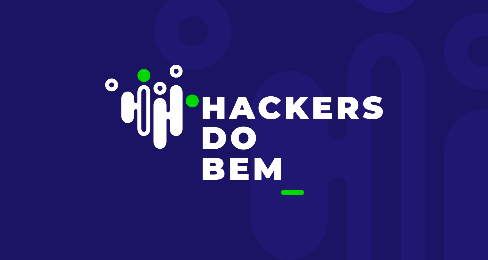

<h1 align="center"> Certificados de Formação e Conquistas Acadêmicas 🏆 </h1>

<h2 align="justify" >
Este repositório é dedicado aos meus certificados obtidos ao longo da minha jornada acadêmica e profissional, incluindo cursos, eventos, workshops e formações que fortaleceram minha carreira em tecnologia e educação. Cada certificado representa uma etapa de aprendizado e dedicação em áreas como desenvolvimento de software, educação digital, metodologias pedagógicas e outras habilidades essenciais. 

 Explore o repositório para acompanhar minha trajetória e habilidades desenvolvidas em diferentes áreas.</h2>

## 3ª Semana Nacional da Educação Profissional e Tecnológica

- InovEPT - [Certificado](./Certificados/3ª%20SEMANA%20NACIONAL%20DA%20EDUCAÇÃO%20PROFISSIONAL%20E%20TECNOLÓGICA.pdf)

## Campus Party Brasil
        
   

- Campus Party Brasil 15 - 700h - [Certificado](./Certificados/Campus%20Party/Certificado%20Campus%20Party.pdf)
- Campus Party Brasil 16 - 200h - [Certificado](./Certificados/Campus%20Party/Certificado%20Campus%20Party%2016.pdf)

 
--- 

## Certsys

    

- Fundamentos de Data Science - 20h - 07/22 - [Certificado](./Certificados/Certsys/Certificado%20Fundamentos%20de%20Data%20Science.pdf)

---

## CEPEDI

### Comunicação
- Comunicação assertiva: reduzindo conflitos e frustrações - 6h - 09/24 - [Certificado](./Certificados/CEPEDI/Comunicação/Certificado%20Comunicação%20assertiva%20reduzindo%20conflitos%20e%20frustrações.pdf)

- Comunicação: como se expressar bem e ser compreendido - 12h - 09/24 - [Certificado](./Certificados/CEPEDI/Comunicação/Certificado%20Comunicação%20como%20se%20expressar%20bem%20e%20ser%20compreendido.pdf)

- Comunicação não violenta: consciência para agir - 8h - 09/24 - [Certificado](./Certificados/CEPEDI/Comunicação/Certificado%20Comunicação%20não%20violenta%20consciência%20para%20agir.pdf)

- Comunicação não violenta parte 2: mantendo a empatia - 4h - 10/24 - [Certificado](./Certificados/CEPEDI/Comunicação/Certificado%20Comunicação%20não%20violenta%20parte%202%20mantendo%20a%20empatia.pdf)

- Comunicação participativa: liderança eficaz e motivadora - 10h - 10/24 - [Certificado](./Certificados/CEPEDI/Comunicação/Certificado%20Comunicação%20participativa%20liderança%20eficaz%20e%20motivadora.pdf)

- Feedback efetivo: utilizando ferramentas para comunicação transformadora - 8h - 10/24 - [Certificado](./Certificados/CEPEDI/Comunicação/Certificado%20Feedback%20efetivo%20utilizando%20ferramentas%20para%20comunicação%20transformadora.pdf)

### Comunicação de Liderança
- Comunicação estratégica na liderança: como engajar e influenciar pessoas - 8h - 10/24 - [Certificado](./Certificados/CEPEDI/Comunicação%20de%20Liderança/Certificado%20Comunicação%20estratégica%20na%20liderança%20como%20engajar%20e%20influenciar%20pessoas.pdf)

- Comunicação participativa: liderança eficaz e motivadora - 10h - 10/24 - [Certificado](./Certificados/CEPEDI/Comunicação%20de%20Liderança/Certificado%20Comunicação%20participativa%20liderança%20eficaz%20e%20motivadora.pdf)

- Negociação para líderes: desenvolva a habilidade e consiga bons acordos - 8h - 10/24 - [Certificado](./Certificados/CEPEDI/Comunicação%20de%20Liderança/Certificado%20Negociação%20para%20líderes%20desenvolva%20a%20habilidade%20e%20consiga%20bons%20acordos.pdf)

- Oratória para líderes: como se comunicar profissionalmente - 8h - 10/24 - [Certificado](./Certificados/CEPEDI/Comunicação%20de%20Liderança/Certificado%20Oratória%20para%20líderes%20como%20se%20comunicar%20profissionalmente.pdf)

- Oratória: supere desafios com confiança - 6h - 10/24 - [Certificado](./Certificados/CEPEDI/Comunicação%20de%20Liderança/Certificado%20Oratória%20supere%20desafios%20com%20confiança.pdf)

--- 

## Coursera + CIEE + Google

- **Certificado Profissional em Suporte em TI do Google - [Certificado](./Certificados/Coursera%20CIEE%20Google/Certificado%20Suporte%20em%20TI%20do%20Google.pdf)**

- Administração de Sistemas e serviços de Infraestrutura em TI - 29h - 02/24 - [Certificado](./Certificados/Coursera%20CIEE%20Google/Certificado%20Administração%20de%20Sistemas%20e%20Serviços%20de%20Infraestrutura%20de%20TI.pdf)

- Estrutura e Funcionamento das Redes de Computadores - 30h - 10/23 - [Certificado](./Certificados/Coursera%20CIEE%20Google/Certificado%20Estrutura%20e%20Funcionamento%20das%20Redes%20de%20Computadores.pdf)

- Fundamentos do Suporte Técnico - 24h - 08/23 - [Certificado](./Certificados/Coursera%20CIEE%20Google/Certificado%20Fundamentos%20de%20Suporte%20Técnico.pdf)

- Segurança de TI - 35h - 01/24 - [Certificado](./Certificados/Coursera%20CIEE%20Google/Certificado%20Segurança%20de%20TI.pdf)

- Sistemas Operacionais e Você: Tornando-se um Usuário Avançado - 37h - 12/23 - [Certificado](./Certificados/Coursera%20CIEE%20Google/Certificado%20Sistemas%20Operacionais%20e%20Você.pdf)
 

---

## Defensoria Pública
     

 - Estágio em Informática - 03/22 - 01/24 - [Certificado](./Certificados/Defensoria%20Pública/Certificado%20Estagio%20Defensoria%20Pública.pdf)

---

## Instituto Federal de Educação, Ciência e Tecnologia

    

### Cursos e Projetos

- Banco de Dados - 40h - 02/23 - [Certificado](./Certificados/IF/Certificado%20Banco%20de%20Dados.pdf)

- Educação Profissional e o Novo Ensino Médio - 25h - 01/23 - [Certificado](./Certificados/IF/Certificado%20Educação%20Profissional%20e%20o%20Novo%20Ensino%20Médio.pdf)

- Formação Inicial e Continuada em Estatística Descritiva - 200h - 11/20 - [Certificado](./Certificados/IF/Certificado%20Estatistica%2001.pdf)

- Linguagem PHP - 40h - 09/22 - [Certificado](./Certificados/IF/Certificado%20Linguagem%20PHP.pdf)

- Manutenção de Computadores - 60h - 01/22 - [Certificado](./Certificados/IF/Certificado%20Manutenção%20de%20Computadores.pdf)

- Monitor Voluntario de Informática Básica I - 60h - 02/22 - 07/22 - [Certificado](./Certificados/IF/Declaração%20Licenciatura%20Intercultural%20Indígena.pdf)

- Monitor do Projeto de Algoritmo - 312h - 12/22 - [Certificado](./Certificados/IF/Certificado%20Monitoria%20Algoritmo.pdf)

- Projeto Robótica Educacional como Possibilidade de Iniciação à Programação nas Escolas Públicas - 01/22 - 12/22 - [Certificado](./Certificados/IF/Declaração%20Projeto%20Robótica.pdf)

- Projeto Robótica Educacional e Ensino de Computação na Educação Básica - 03/23 - 01/24 - [Certificado](./Certificados/IF/Declaração%20Robotica%202023.pdf)

- Python - 2h - 01/23 - [Certificado](./Certificados/IF/Certificado%20Python.pdf)

- Residência Pedagógica - 11/22 - 04/24 - [Certificado](./Certificados/IF/Declaração%20Projeto%20Residência%20Pedagógica.pdf)

- Robótica Básica - 30h - 05/17 - [Certificado](./Certificados/IF/Certificado%20Robótica%20Básica.pdf)

- Segurança no Trabalho e Eletricidade Básica - 40h - 06/22 - [Certificado](./Certificados/IF/Certificado%20Segurança%20no%20Trabalho%20e%20Eletricidade%20Básica.pdf)

---

## Hackers do Bem

- Formação em Cibersegurança - 80h - 03/24 - [Certificado](./Certificados/Hackers%20do%20Bem/Certificado%20Formação%20em%20Cibersegurança.pdf)

---

## Loiane Training

- Java Básico - 30h - 07/22 - [Certificado](./Certificados/Loiane%20Training/Certificado%20Java%20Basico.pdf)

---

## Ministério da Educação

- Português - 60h - 07/21 - [Certificado](./Certificados/Ministério%20da%20Educação/Certificado%20Português.pdf)

---

## Programa ONE T6

- **Conclusão do Programa Oracle Next Education F2 T6 Back-end - 303h - 07/24** - [Certificado](./Certificados/ONE%20T6/Certificado%20Oracle%20Next%20Education%20F2%20T6%20Back-end.pdf)

- Formação Aprenda a Programar em Java com Orientação a Objetos - 39h - 05/24 - [Certificado](./Certificados/ONE%20T6/Formação%20Aprenda%20a%20Programar%20em%20Java%20com%20Orientação%20a%20Objetos/Certificado%20Formação%20Aprenda%20a%20programar%20em%20Java%20com%20Orientação%20a%20Objetos.pdf)

- Formação Desenvolvimento Pessoal - 38h - 01/24 - [Certificado](./Certificados/ONE%20T6/Formação%20Desenvolvimento%20Pessoal/Certificado%20Formação%20Desenvolvimento%20Pessoal%20T6%20-%20ONE.pdf)

- Formação Empreendedorismo, Agilidade e Protagonismo na Carreira - 54h - 05/24 - [Certificado](./Certificados/ONE%20T6/Formação%20Empreendedorismo,%20Agilidade%20e%20Protagonismo%20na%20Carreira/Certificado%20Formação%20Empreendedorismo,%20Agilidade%20e%20Protagonismo%20na%20Carreira.pdf)

- Formação Iniciante em Programação - 54h - 02/24 - [Certificado](./Certificados/ONE%20T6/Formação%20Iniciante%20em%20Programação/Certificado%20Formação%20Iniciante%20em%20Programação%20T6.pdf)

- Formação Java e Orientação a Objetos - 49h - 05/24 - [Certificado](./Certificados/ONE%20T6/Formação%20Java%20e%20Orientação%20a%20Objetos/Certificado%20Formação%20Java%20e%20Orientação%20a%20Objetos.pdf)

- Formação Java e Spring Boot - 34h - 07/24 - [Certificado](./Certificados/ONE%20T6/Formação%20Java%20e%20Spring%20Boot/Certificado%20Formação%20Java%20e%20Spring%20Boot.pdf)

- Formação Java e Spring Framework - 108h - 07/24 - [Certificado](./Certificados/ONE%20T6/Formação%20Java%20e%20Spring%20Framework/Certificado%20Formação%20Java%20e%20Spring%20Framework.pdf)

- Java Web Crie Aplicações Usando Spring Boot - 40h - 06/24 - [Certificado](./Certificados/ONE%20T6/Formação%20Java%20Web%20Crie%20Aplicações%20Usando%20Spring%20Boot/Certificado%20Formação%20Java%20Web%20Crie%20Aplicações%20Usando%20Spring%20Boot.pdf)

- Formação Minha Carreira - 40h - 04/24 - [Certificado](./Certificados/ONE%20T6/Formação%20Minha%20Carreira/Certificado%20Formação%20Minha%20carreira%20T6.pdf)

### ONE | Allumni

#### Formação Oracle Cloud Infrastructure - 21h - 10/24 - [Certificado](./Certificados/ONE%20T6/Allumni/Formação%20Oracle%20Cloud%20Infrastructure/Certificado%20Oracle%20Cloud%20Infrastructure%20-%20ONE.pdf)

- Banco de dados e infraestrutura como código - 8h - 10/24 - [Certificado](./Certificados/ONE%20T6/Allumni/Formação%20Oracle%20Cloud%20Infrastructure/Certificado%20Banco%20de%20dados%20e%20infraestrutura%20como%20código.pdf)

- Implantação de uma aplicação na nuvem - 8h - 10/24 - [Cetificado](./Certificados/ONE%20T6/Allumni/Formação%20Oracle%20Cloud%20Infrastructure/Certificado%20Implantação%20de%20uma%20aplicação%20na%20nuvem.pdf)

#### Formação IA Generativa - 25h - 10/24 - [Certificado](./Certificados/ONE%20T6/Allumni/Formação%20IA%20Generativa/Certificado%20IA%20Generativa%20-%20ONE.pdf)

- ChatGPT e JavaScript: construa o jogo Pong - 8h - 07/24 - [Certificado](./Certificados/ONE%20T6/Allumni/Formação%20IA%20Generativa/Certificado%20ChatGPT%20e%20JavaScript%20construa%20o%20jogo%20Pong.pdf)

- ChatGPT e programação: aumente sua produtividade - 8h - 10/24 - [Certificado](./Certificados/ONE%20T6/Allumni/Formação%20IA%20Generativa/Certificado%20ChatGPT%20e%20programação%20aumente%20sua%20produtividade.pdf)

- ChatGPT: otimizando a qualidade dos resultados - 8h - 07/24 - [Certificado](./Certificados/ONE%20T6/Allumni/Formação%20IA%20Generativa/Certificado%20ChatGPT%20otimizando%20a%20qualidade%20dos%20resultados.pdf)
